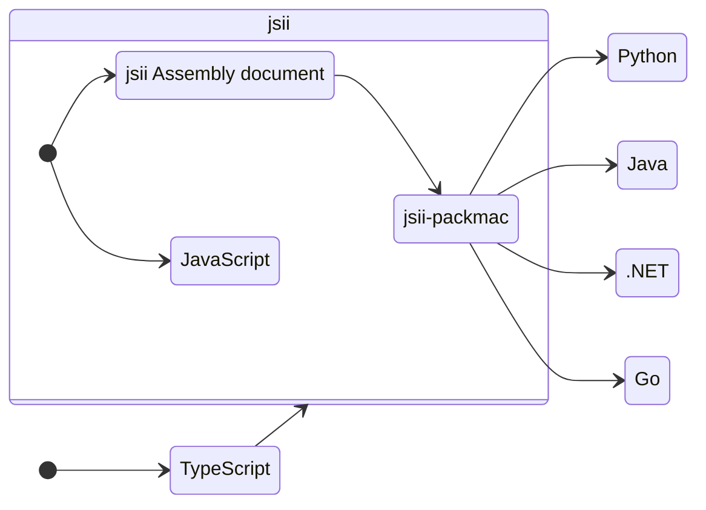

# AWS CDK の<span class="font-bold underline decoration-solid underline-offset-8">トリ</span>ビア
～明日使えるムダ知識をあなたに～

アマゾン ウェブ サービス ジャパン合同会社<br>
ソリューションアーキテクト<br>
吉川 幸弘<br>
2024/4/24

<style>
.slidev-layout {
  background-image: linear-gradient(rgba(0, 0, 0, 0.7), rgba(0, 0, 0, 0.8)), url(/profile.png);
}

</style>

---
hideInToc: true
---

<Toc maxDepth="1"/>

---
layout: intro
---

<div class="flex opacity-90">
  <div class="basis-1/4">
    <div  class="rounded-full h-40 w-40 mx-auto" style="background-color: #6CBDCD">
      
    </div>
    <div class="py-3 text-center">
      <div class="text-4xl font-bold">吉川 幸弘<br>（ゆっきー）</div>
      <div class="pt-1 text-2xl opacity-80">@WinterYukky</div>
    </div>
    <div class="flex justify-around px-5">
      <a href="https://github.com/WinterYukky" target="_blank" alt="GitHub" class="text-xl icon-btn opacity-50 !border-none !hover:text-white">
        <mdi-github class="text-3xl" />
      </a>
      <a href="https://twitter.com/WinterYukky" target="_blank" alt="Twitter" class="text-xl icon-btn  !border-none !hover:text-sky-500 !hover:opacity-100">
        <mdi-twitter class="text-3xl text-sky-500 opacity-50" />
      </a>
    </div>
  </div>
  <div class="basis-3/4 pl-10 grid content-center">
    <ul class="text-2xl">
      <li>アマゾン ウェブ サービス ジャパン合同会社</li>
      <li>大阪のソリューションアーキテクト</li>
      <li>AWS CDK 大好き</li>
    </ul>
  </div>
</div>


---
layout: cover
---

# 本セッションの楽しみ方

このセッションは知っていても役に立たない AWS CDK の雑学を紹介します。
これらの知識を持っていても AWS CDK アプリケーションを構築するのに役立つことはあまりないかもしれませんが、知っていると AWS CDK について詳しくなった気分になれるのでセッション終了後に身近な人に自慢してみてください。自慢できる方がいない方は私と一緒に飲みに行きましょう。

---

# AWS CDK は複数の言語で書くことができる

<div class="grid grid-cols-3 gap-6 place-content-center h-80 text-center">
  <div class="py-4 bg-cyan-400 rounded">JavaScript</div>
  <div class="py-4 bg-cyan-400 rounded">TypeScript</div>
  <div class="py-4 bg-cyan-400 rounded">Python</div>
  <div class="py-4 bg-cyan-400 rounded">Java</div>
  <div class="py-4 bg-cyan-400 rounded">.NET</div>
  <div class="py-4 bg-cyan-400 rounded">Go</div>
</div>

---
layout: center
---

# AWS CDK を Python や Java で書いても実際の処理は Node.js が行っている

実際に動かしてみると Node.js ランタイムが必要。なぜか？

---
layout: center
---

## Q. Node.js じゃないのになぜ Node.js ランタイムが必要？
<h2 v-click class="mt-5"> A. AWS CDK は jsii で動いているため</h2>

---

# jsii ってなんだ

あらゆる言語のコードが JavaScript クラスと自然に対話できるようになるテクノロジ。AWS CDK は jsii を使って TypeScript で書かれた単一のコードベースから多言語ライブラリを提供している。



---
layout: section
---

# jsii を使ってみる

---
layout: two-cols-header
---

# TypeScript から多言語へ変換

::left::


```ts {all|none}
// サンプルコードを用意
export interface GreeterProps {
  readonly greetee: string;
}

export class Greeter {
  private readonly greetee: string;

  public constructor(props: GreeterProps) {
    this.greetee = props.greetee;
  }

  public greet(): string {
    return `Hello, ${this.greetee}!`;
  }
}
```

<v-click at="2">
  <div class="text-xl">各言語用のモジュールが生成される</div>
  <arrow x1="390" y1="425" x2="490" y2="425" class="text-red"/>
</v-click>

::right::

<div class="ml-5">


```text {none|1-2|4-23}{at:1}
$ jsii-package
Done in 16.95s.

$ tree dist
dist
├── dotnet
│   ├── Amazon.Module.1.0.0-devpreview.nupkg
│   └── Amazon.Module.1.0.0-devpreview.snupkg
├── java
│   └── software
│       └── amazon
│           └── module
│               └── core
│                   ├── 1.0.0.DEVPREVIEW
│                   │   ├── core-1.0.0.DEVPREVIEW-javadoc.jar
│                   │   ├── ...省略
│                   │   └── core-1.0.0.DEVPREVIEW.pom.sha1
│                   ├── ..省略
├── js
│   └── jsii-example@1.0.0.jsii.tgz
└── python
    ├── module-name.core-1.0.0.tar.gz
    └── module_name.core-1.0.0-py3-none-any.whl
```

</div>

---
layout: fact
---

## Q. jsii で他言語モジュールに変換したし、もう実行時に Node.js は要らないんじゃない？

<h2 v-click class="mt-5"> A. いいえ、jsii-runtime を使うので必要です </h2>

---
layout: two-cols-header
---

# Python を使って確認してみる

::left::


```python {all|none}
# さっきの TypeScript コードから作られたモジュール
from module_name.core import Greeter 

greeter = Greeter(greetee='jsii')
print(greeter.greet())
```

```sh {none|all|none}{at:1}
$ python3 index.py
Hello, jsii!
```

::right::

<div class="ml-5">

```python {none|all|8-9}{at:2}
class Greeter(metaclass=jsii.JSIIMeta, jsii_type="jsii-example.Greeter"):

    def __init__(self, *, greetee: builtins.str) -> None:
        props = GreeterProps(greetee=greetee)
        jsii.create(self.__class__, self, [props])

    @jsii.member(jsii_name="greet")
    def greet(self) -> builtins.str:
        return typing.cast(builtins.str, jsii.invoke(self, "greet", []))
```

```ts {none|all|9-11}{at:2}
// 元のコード
export class Greeter {
  private readonly greetee: string;

  public constructor(props: GreeterProps) {
    this.greetee = props.greetee;
  }

  public greet(): string {
    return `Hello, ${this.greetee}!`;
  }
}
```

</div>
<v-click at="3" class="static">
  <div class="absolute bottom-50 left-40 text-2xl">変換されたコードが異なる</div>
</v-click>

---
layout: two-cols-header
---

# jsii ランタイムアーキテクチャ

::left::


https://aws.github.io/jsii/overview/runtime-architecture/

::right::

- `jsii-runtime` は Node.js で動いている
- Host Application は 標準入力・出力を通して jsii-runtime とコミュニケーションする
  - Java などが CLI を通して JavaScript を操作しているようなイメージ


---
layout: section
---

# jsii-runtime を使ってみる

---
layout: two-cols-header
---

# jsii-runtime がどう動いているか確認する

::left::

```python {all|6-8}
import time
from module_name.core import Greeter

greeter = Greeter(greetee='jsii')

# プログラムが終わらないようにする
while True:
    time.sleep(30)
```

```sh {none|all}
# 修正した Python コードを実行
$ python3 index.py
```

::right::

<div class="ml-5 h-80">

```sh {none|all|4}
$ ps -x
20071 pts/2    Ss     0:00 /usr/bin/zsh -i
61768 pts/0    Sl+    0:00 /home/superchain/.rye/py/cpython@3.12.2/bin/python3 index.py
61770 pts/0    Sl+    0:00 node --max-old-space-size=4069 /tmp/tmprtmlxn58/bin/jsii-runtime.js
61779 pts/0    Sl+    0:00 /usr/bin/node --max-old-space-size=4069 --preserve-symlinks /tm...
61921 ?        S      0:00 sleep 1
61926 pts/2    R+     0:00 ps -x
```

  <v-click at="4">
    <div class="text-xl text-center mt-7">jsii-runtime.js が動いていることを確認</div>
    <arrow x1="650" y1="360" x2="650" y2="280" class="text-red"/>
  </v-click>
</div>

---

# 直接 jsii-runtime を実行する

```json {all|1-2|3|4|5|6|7|8}
$ node --max-old-space-size=4069 /tmp/tmprtmlxn58/bin/jsii-runtime.js
{"hello":"@jsii/runtime@1.97.0"}
{"api": "load", "name": "jsii-example", "version": "1.0.0", "tarball": "dist/js/jsii-example@1.0.0.jsii.tgz"}
{"ok":{"assembly":"jsii-example","types":2}}
{"api": "create", "fqn": "jsii-example.Greeter", "args": [{"$jsii.struct": {"fqn": "jsii-example.GreeterProps", "data": {"greetee": "jsii"}}}]}
{"ok":{"$jsii.byref":"jsii-example.Greeter@10000"}}
{"api": "invoke", "objref": {"$jsii.byref": "jsii-example.Greeter@10000"}, "method": "greet"}
{"ok":{"result":"Hello, jsii!"}}
```

命令内容の詳細は jsii Kernel API ドキュメントを参照  
https://aws.github.io/jsii/specification/3-kernel-api/

---

# まとめ

- AWS CDK は jsii で多言語対応をしている
- jsii で変換されたモジュールは実行時に Node.js が必要
  - そのため、AWS CDK が非 Node.js で書かれていても Node.js が必要
- jsii は標準入出力を通して JSON で他言語とコミュニケーションする
  - 開発ツールやビルドツールに最適
  - 逆にパフォーマンスが必要なアプリケーションには向かない
    - 常に JSON へ変換するためコストがかかる
    - jsii にガベージコレクタ機能がない

---
layout: section
---

# Thank you!